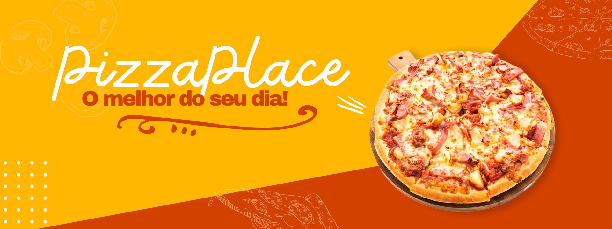
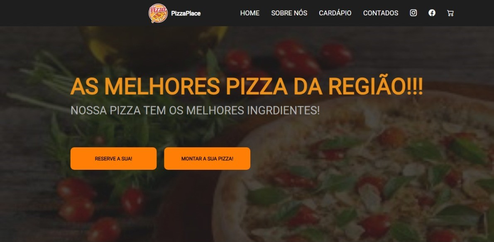
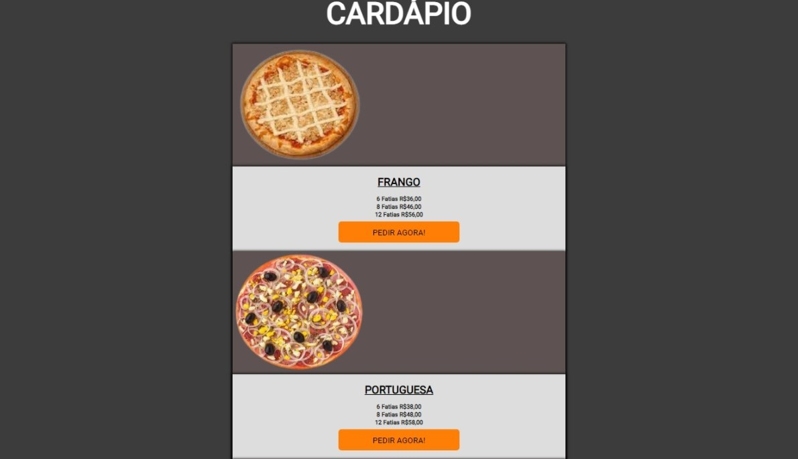

# Apresentação ✨🚀
Nesse trabalho, tivemos o desafio de criar um Cardápio Web!
Utililando HTML e CSS.
Podiamos escolher oque iriamos vender, e qual seria nossa loja, minha escolha foi uma Pizzaria!!!🍕

# Interface ✨📸

# Cardápio  ✨🍕

# Ferramentas utilizadas ✨⚙️🪛
* CSS
* GitHub

# Fonte ✨🧩
Eu utilizei um vídeo do youtube para realizar esta atividade, do canal Crislaine D'Paula.

